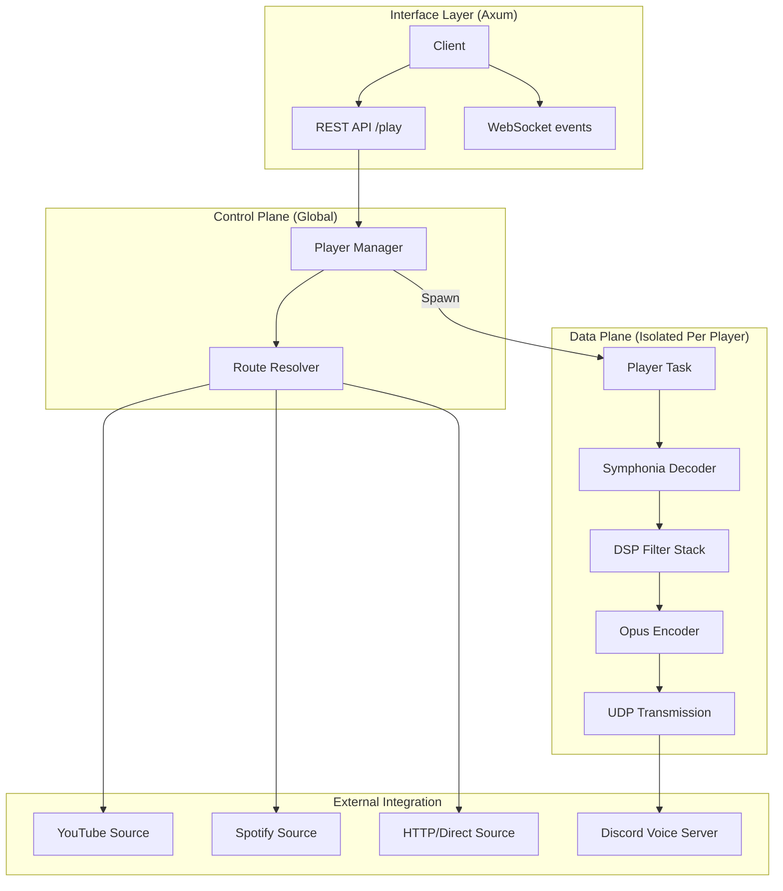

import { Badge, Steps, Card, CardGrid } from "@astrojs/starlight/components";

Rustalink is engineered for extreme performance, leveraging Rust's safety and concurrency primitives to handle high-density audio streaming with predictable latency.

---

## Technical Foundation

Rustalink is built on a "Shared-Nothing" architecture where each player is an isolated unit of execution.

<CardGrid>
  <Card title="Tokio" icon="rocket">
    The multi-threaded, asynchronous runtime that powers our concurrent task management and networking.
  </Card>
  <Card title="Symphonia" icon="setting">
    A pure Rust audio decoding and media demuxing library, ensuring safety and performance without C dependencies.
  </Card>
  <Card title="Axum" icon="external">
    A web framework that provides a fast, ergonomic REST interface and built-in WebSocket support.
  </Card>
  <Card title="Opus" icon="random">
    High-fidelity audio encoding used for the final transmission to Discord's voice servers.
  </Card>
</CardGrid>

---

## The Audio Data Flow

Every track played through Rustalink undergoes a rigorous transformation process to ensure the highest fidelity and lowest overhead.

### 1. Decoding & Demuxing
We use **Symphonia** for its strict adherence to Rust's safety guarantees.
- **Demuxing**: Extracting raw bitstreams from containers (MP4, MKV, WebM, FLAC, etc.).
- **Decoding**: Converting compressed bitstreams into raw Pulse Code Modulation (PCM) samples.
- **Resampling**: If the source sample rate differs from Discord's 48kHz, we use a high-quality sinc interpolator to resample the audio with minimal aliasing.

### 2. DSP Pipeline (The Filter Stack)
All audio processing in Rustalink happens in a **32-bit floating-point (`f32`) space**.
- **Internal Representation**: Frames are processed as `Vec<f32>` to avoid the rounding errors and clipping typical of 16-bit integer math.
- **Filter Chain**: Each filter (Equalizer, Vibrato, Timescale, etc.) is an isolated stage in a chain.
- **SIMD Optimization**: Where available, we utilize SIMD (Single Instruction, Multiple Data) to process multiple samples in a single CPU cycle.

### 3. Encoding & Transmission
- **Opus Encoding**: The final `f32` samples are converted back to PCM and encoded into Opus frames.
- **Zero-Copy UDP**: We optimize the networking stack to minimize copying of Opus packets before they are dispatched to Discord's voice servers via encrypted UDP.

---

## Concurrency & Resource Management

### Shared-Nothing Model
Each voice connection (Player) runs in its own dedicated **Tokio task**.
- **Isolation**: A crash or slow processing in one player (e.g., due to complex filtering) cannot lag or affect other players.
- **Message Passing**: Communication between the global `PlayerManager` and individual `Player` tasks occurs via high-speed `mpsc` (Multi-Producer, Single-Consumer) channels.

### Memory Stewardship
Rustalink avoids the "Stop-the-World" pauses inherent in garbage-collected languages (like Java/JVM).
- **Pre-allocation**: Buffer pools are used to recycle memory for audio frames, reducing the pressure on the system allocator.
- **Deterministic Cleanup**: Resources (decoders, filters, network sockets) are dropped immediately when a track ends or a player stops.

---

## Internal Architecture Diagram

The following diagram illustrates the lifecycle of a command moving from the client to the audio output.

